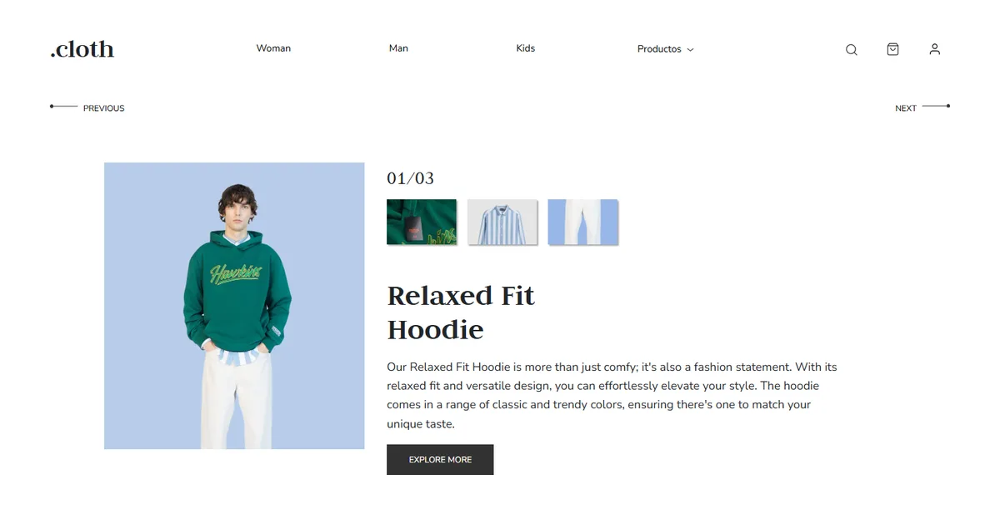

# .cloth

> Landing de una tienda de ropa: un producto, tres vistas, en una sola pantalla.



**Demo:** https://cloth.wib.digital · **Año:** 2024 · **Rol:** Diseño y desarrollo

## Sobre el proyecto

Maqueta de la página de inicio de una marca de ropa ficticia. Toda la propuesta cabe
en una pantalla: cabecera con categorías, un carrusel de tres vistas del mismo
producto con sus miniaturas de detalle, y pie con redes.

El proyecto existía desde 2024. Esta versión es una pasada completa de auditoría y
pulido: se conservó el diseño y todo el contenido, y se reconstruyó lo que había
debajo. El detalle está en [`CHANGELOG.md`](CHANGELOG.md).

## Stack

HTML5 · CSS3 (custom properties, grid, flex, `clamp()`) · JavaScript vanilla

**Sin dependencias, sin build step y sin peticiones a terceros.** Las fuentes
(Judson y Nunito Sans, ambas OFL) están autoalojadas.

## Características

- Carrusel propio: prev/next, circular, navegable con flechas del teclado y con
  rotación automática que se pausa al pasar el ratón, al enfocar dentro, al ocultar
  la pestaña y con `prefers-reduced-motion`.
- Menú móvil que cierra con `Esc` devolviendo el foco, al navegar y al volver a
  escritorio, con `aria-expanded` y bloqueo de scroll sincronizados.
- Accesibilidad WCAG AA verificada: contraste medido nodo a nodo, foco visible en las
  17 paradas de tabulación, áreas táctiles de 44 px en los 8 breakpoints.
- Tipografía fluida con `clamp()`: un solo breakpoint en todo el proyecto.
- Imágenes WebP con `width`/`height`, `lazy` salvo la LCP, y CLS de 0.
- `404.html` con la identidad del sitio.

## Estructura

```
.cloth/
├── index.html
├── 404.html
├── assets/
│   ├── css/      tokens · fonts · base · layout · components · utilities
│   ├── js/       main.js
│   ├── img/      6 fotos WebP + logo
│   ├── icons/    9 SVG optimizados
│   └── fonts/    Judson 400/700 · Nunito Sans variable (woff2)
├── seo/
│   ├── og-image.webp · og-image.jpg
│   └── favicon/  ico · 192 · 512 · apple-touch · webmanifest
└── docs/         auditorías, tokens y capturas
```

Las hojas de estilo se cargan en este orden y no debe alterarse:
`tokens → fonts → base → layout → components → utilities`.

## Uso local

```bash
git clone https://github.com/pabloWIB/.cloth.git
cd .cloth
npx serve .
```

No hay nada que instalar ni compilar. También sirve `python -m http.server 8000`.

## Rendimiento

Lighthouse 12, servido sin gzip ni HTTP/2 (el peor escenario). Comparado contra el
commit `b3456ae`, el estado previo a esta pasada.

| Métrica | Antes | Después |
|---|---:|---:|
| Lighthouse Performance (móvil) | 67 | **99-100** |
| Accessibility | 96 | **100** |
| Best Practices | 100 | **100** |
| SEO | 91 | **100** |
| LCP (móvil) | 7.1 s | **1.6-2.0 s** |
| CLS | 0.021 | **0** |
| TBT | 170 ms | **0 ms** |
| Peso total transferido | 1.17 MB | **149 KB** |
| Peticiones a terceros | 10 | **0** |

En escritorio: **100 en las cuatro categorías**.

## Decisiones técnicas

**Fuera jQuery, Popper y Bootstrap.** El proyecto cargaba 351 KB de terceros —jQuery
dos veces, una de ellas una beta que ni siquiera se usaba, más Popper sin un solo
componente que lo necesitara— para mover un carrusel de tres slides. Se reemplazaron
por 136 líneas de JavaScript propio, 4.7 KB. El carrusel resultante hace más que el de
Bootstrap: responde al teclado y su rotación automática se puede pausar, algo que la
versión con `data-ride` no permitía y que incumplía WCAG 2.2.2.

**El CSS dependía de Bootstrap sin saberlo.** La clase `.container` que daba ancho a
las slides era la del framework, no la del proyecto, y el color del texto (`#212529`)
venía de su `$body-color`. Ambos valores se fijaron explícitamente antes de retirarlo,
de modo que quitar 141 KB de CSS no cambió un solo píxel.

**El 96 % del peso eran imágenes, y el 60 % ni se usaba.** Cinco archivos huérfanos
(1.59 MB) que ningún HTML, CSS ni JS referenciaba. El favicon era un PNG de 1024×1024
y 642 KB para un hueco de 32 px. Tras convertir a WebP, redimensionar y reconstruir el
favicon: **2.68 MB → 194 KB**.

**Un breakpoint en lugar de tres.** Los de 915 px y 800 px solo reescalaban tipografía;
ese trabajo lo hace ahora `clamp()` de forma continua. Queda uno, el cambio de nav a
hamburguesa.

## Documentación

| Documento | Contenido |
|---|---|
| [`CHANGELOG.md`](CHANGELOG.md) | Qué cambió en esta pasada, por fases |
| [`docs/audit-inventory.md`](docs/audit-inventory.md) | Inventario y estado inicial del repo |
| [`docs/design-tokens.md`](docs/design-tokens.md) | Color, tipografía, escala, espaciado, breakpoints |
| [`docs/assets.md`](docs/assets.md) | Imágenes: antes/después, dimensiones y peso |
| [`docs/responsive-audit.md`](docs/responsive-audit.md) | Problemas por breakpoint y su causa |
| [`docs/ux-audit.md`](docs/ux-audit.md) | Hallazgos UX/UI/a11y con severidad y estado |
| [`docs/performance.md`](docs/performance.md) | Métricas antes/después |
| [`docs/qa-final.md`](docs/qa-final.md) | Checklist de QA y cross-browser |
| [`docs/improvements.md`](docs/improvements.md) | Mejoras propuestas **no** aplicadas |
| [`docs/needs-input.md`](docs/needs-input.md) | Qué falta para darlo por terminado |

## Licencia

MIT © Pablo Nieto — ver [`LICENSE`](LICENSE).

> Las fotografías de producto pertenecen a una colección de terceros y **no** están
> cubiertas por esta licencia. Ver [`docs/needs-input.md`](docs/needs-input.md) A3.
