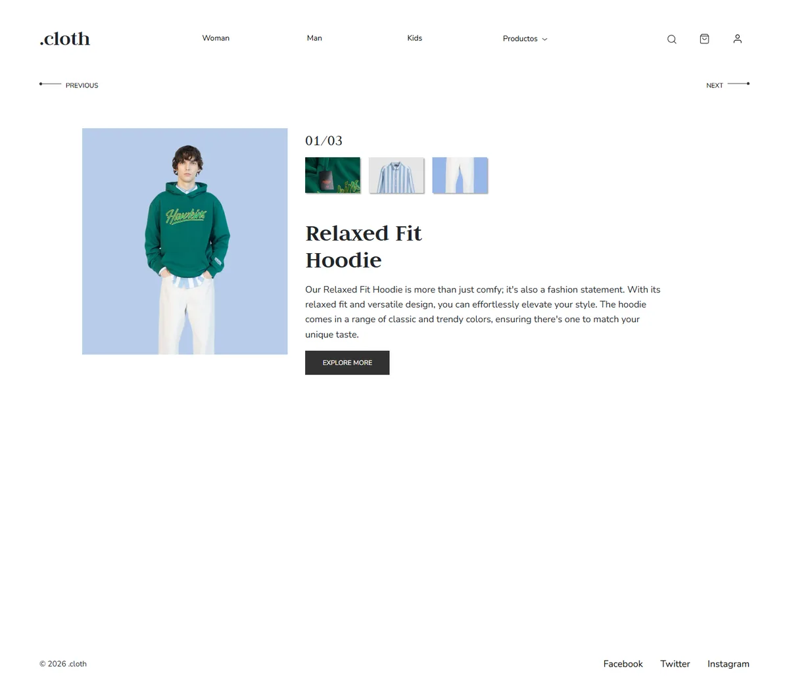
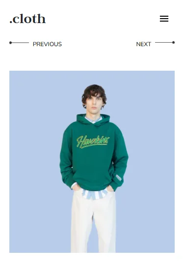
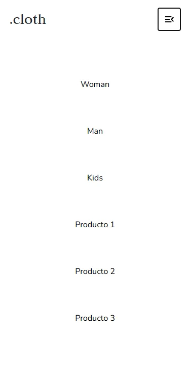

# Cloth-Landing

Clothing store landing page: one product, three views, on a single screen.

[](https://cloth.wib.digital)
[](https://www.fiverr.com/pablonietop)


[](LICENSE)


## Description

Home page for a fictional clothing brand. The whole proposition fits on one screen: a header with categories, a carousel showing three views of the same product with detail thumbnails, and a footer with social links. The wordmark `.cloth` is styled with its leading dot; the repository is named without it.

The project dates from 2024. This version is a full audit and rebuild pass: the design and all the content were kept, and everything underneath was replaced. It shipped carrying 351 KB of third-party JavaScript to move a three-slide carousel, and 2.68 MB of images of which 60% were never referenced. Both are gone.

The result is a static site with no dependencies, no build step and no third-party requests. Fonts are self-hosted. Full detail is in [`CHANGELOG.md`](CHANGELOG.md).

## Screenshots

| Desktop | Mobile | Mobile menu |
|---|---|---|
|  |  |  |

The 404 page is at [`docs/screenshots/pagina-404.webp`](docs/screenshots/pagina-404.webp), and the pre-rebuild state at [`antes-desktop.webp`](docs/screenshots/antes-desktop.webp) and [`antes-movil.webp`](docs/screenshots/antes-movil.webp).

## Features

- Hand-written carousel: previous and next, wrapping, keyboard arrow support, and auto-rotation that pauses on hover, on focus within, on tab hide and under `prefers-reduced-motion`.
- Mobile menu that closes on `Esc` returning focus, on navigation and on resize back to desktop, keeping `aria-expanded` and the scroll lock in sync.
- WCAG AA verified: contrast measured node by node, visible focus across all 17 tab stops, 44 px touch targets at all 8 breakpoints.
- Fluid typography with `clamp()`, leaving a single breakpoint in the whole project.
- WebP images with explicit `width` and `height`, lazy except the LCP element, CLS of 0.
- A `404.html` carrying the same identity as the site.

## Tech stack

| Layer | Technology | Version | Role in project |
|---|---|---|---|
| Markup | HTML5 | — | Two pages: `index.html`, `404.html` |
| Styling | CSS3 | — | Custom properties, grid, flex, `clamp()` |
| Scripting | JavaScript (vanilla) | — | 136 lines in `assets/js/main.js`, 4.7 KB |
| Typography | Judson 400/700, Nunito Sans variable | — | Self-hosted woff2, both OFL licensed |
| Images | WebP | — | 7 files in `assets/img` |
| Icons | SVG | — | 9 optimised files in `assets/icons` |
| Hosting | Vercel | — | Configured in `vercel.json` |
| Tooling | None | — | No bundler, no preprocessor, nothing to install |

## Prerequisites

None to view the site — open `index.html` in a browser.

To serve it over HTTP, either Node.js with `npx`, or Python 3.

## Installation

```bash
git clone https://github.com/pabloWIB/Cloth-Landing.git
cd Cloth-Landing
npx serve .
```

Or without Node.js:

```bash
python -m http.server 8000
```

Serving over HTTP is the closer match to production, because it resolves `404.html` the way a static host does.

## Usage

The stylesheets load in this order and it must not be changed:

```
tokens → fonts → base → layout → components → utilities
```

`tokens.css` defines every colour, size and spacing value as a custom property. Restyling the site means editing that file, not hunting through the components.

The carousel needs no initialisation. `assets/js/main.js` binds on `DOMContentLoaded` and takes over any element matching the carousel markup in `index.html`. Auto-rotation stops on its own when the user shows intent — hovering, focusing inside it, or switching tab — and never starts when the operating system reports reduced-motion.

## Project structure

```
.
├── index.html
├── 404.html
├── assets/
│   ├── css/      tokens · fonts · base · layout · components · utilities
│   ├── js/       main.js — carousel and mobile menu
│   ├── img/      6 product photos in WebP + logo
│   ├── icons/    9 optimised SVG
│   └── fonts/    judson-400 · judson-700 · nunito-sans-var (woff2)
├── seo/
│   ├── og-image.webp · og-image.jpg
│   └── favicon/  ico · 192 · 512 · apple-touch · webmanifest
├── docs/         audits, design tokens and screenshots
├── _archive/     original raster sources, kept out of the build
├── CHANGELOG.md
├── LICENSE
└── vercel.json
```

## Results

Lighthouse 12, served without gzip or HTTP/2 — the worst case. Measured against commit `b3456ae`, the state before this pass.

| Metric | Before | After |
|---|---:|---:|
| Lighthouse Performance (mobile) | 67 | **99-100** |
| Accessibility | 96 | **100** |
| Best Practices | 100 | **100** |
| SEO | 91 | **100** |
| LCP (mobile) | 7.1 s | **1.6-2.0 s** |
| CLS | 0.021 | **0** |
| TBT | 170 ms | **0 ms** |
| Total transferred | 1.17 MB | **149 KB** |
| Third-party requests | 10 | **0** |

Desktop scores 100 in all four categories.

## Technical decisions

**jQuery, Popper and Bootstrap removed.** The project loaded 351 KB of third-party code — jQuery twice, one of them an unused beta, plus Popper without a single component that needed it — to drive a three-slide carousel. They were replaced by 136 lines of project JavaScript, 4.7 KB. The replacement does more than the Bootstrap one: it responds to the keyboard and its auto-rotation can be paused, which the `data-ride` version did not allow and which failed WCAG 2.2.2.

**The CSS depended on Bootstrap without declaring it.** The `.container` class setting slide width was the framework's, not the project's, and the text colour `#212529` came from its `$body-color`. Both were pinned explicitly before removal, so dropping 141 KB of CSS did not move a single pixel.

**96% of the weight was images, and 60% of that was unused.** Five orphan files totalling 1.59 MB that no HTML, CSS or JS referenced. The favicon was a 1024×1024 PNG weighing 642 KB for a 32 px slot. After converting to WebP, resizing and rebuilding the favicon: **2.68 MB → 194 KB**.

**One breakpoint instead of three.** Those at 915 px and 800 px only rescaled type; `clamp()` now does that continuously. The remaining one switches the nav to a hamburger.

## Documentation

| Document | Contents |
|---|---|
| [`CHANGELOG.md`](CHANGELOG.md) | What changed in this pass, by phase |
| [`docs/audit-inventory.md`](docs/audit-inventory.md) | Inventory and initial state of the repository |
| [`docs/design-tokens.md`](docs/design-tokens.md) | Colour, typography, scale, spacing, breakpoints |
| [`docs/assets.md`](docs/assets.md) | Images: before and after, dimensions and weight |
| [`docs/responsive-audit.md`](docs/responsive-audit.md) | Problems per breakpoint and their cause |
| [`docs/ux-audit.md`](docs/ux-audit.md) | UX, UI and accessibility findings with severity and status |
| [`docs/performance.md`](docs/performance.md) | Before and after metrics |
| [`docs/qa-final.md`](docs/qa-final.md) | QA and cross-browser checklist |
| [`docs/improvements.md`](docs/improvements.md) | Proposed improvements **not** applied |
| [`docs/needs-input.md`](docs/needs-input.md) | What is still missing to call it finished |

## Deployment

Deployed on Vercel at [cloth.wib.digital](https://cloth.wib.digital), configured in `vercel.json`. The site is static: upload the repository root as-is, with no build command and no output directory.

## License

MIT © Pablo Nieto — see [`LICENSE`](LICENSE).

> The product photography belongs to a third-party collection and is **not** covered by this licence. See [`docs/needs-input.md`](docs/needs-input.md), item A3.

## Author

**Pablo Nieto Pérez** — [wib.digital](https://wib.digital)
GitHub: [@pabloWIB](https://github.com/pabloWIB)

---

## Hire me

I build **custom internal tools, CRMs and dashboards** for small teams, and
**conversion-focused websites** for businesses.

- [Custom internal tool, CRM or dashboard](https://www.fiverr.com/pablonietop/build-a-custom-internal-app-for-your-business) — from $45
- [Conversion-focused website](https://www.fiverr.com/pablonietop/convert-your-landing-page-design-to-code) — from $80
- [All my services on Fiverr](https://www.fiverr.com/pablonietop)
- [wib.digital](https://wib.digital)
